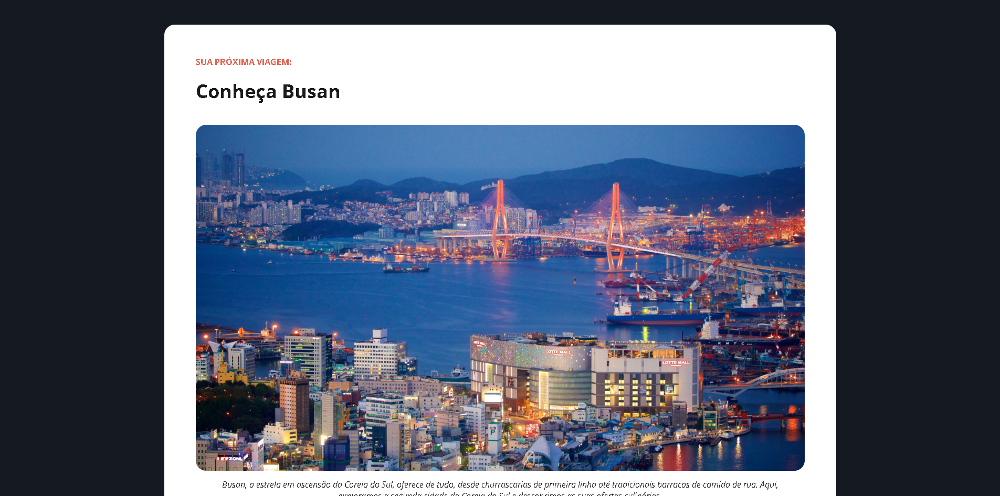

# 🌍 Website Local Turístico

<div align="center">


### ✈️ Página de destino com foco em turismo, tipografia e layout editorial


</div>

---

## 🚀 Demonstração

🔗 **Live Preview:** https://anaclarissi.github.io/website-local-turistico/

💻 **Repositório:** https://github.com/anaClarissi/website-local-turistico

---

## 📷 Preview

<div align="center">



</div>

---

## 🧠 Sobre o projeto

Este projeto é um **website de destino turístico**, desenvolvido de forma independente com o objetivo de praticar **HTML e CSS focados em layout e tipografia**.

A proposta foi criar uma página informativa sobre a cidade de **Busan (Coreia do Sul)**, com foco em:

* 🎯 Estrutura de conteúdo estilo editorial
* 🎨 Hierarquia visual e tipografia
* 🧩 Organização de seções
* 📖 Experiência de leitura agradável

---

## ⚙️ Funcionalidades

* 🌍 Apresentação de destino turístico
* 🖼 Exibição de imagens com descrição
* 📚 Seção informativa sobre a cidade
* 🏛 Lista de pontos turísticos
* 🎨 Destaque de categorias (cores diferentes)
* 📱 Layout centralizado e organizado

---

## 🛠 Tecnologias utilizadas

<div align="center">

| Tecnologia   | Descrição              |
| ------------ | ---------------------- |
| HTML5        | Estrutura semântica    |
| CSS3         | Estilização e layout   |
| Google Fonts | Tipografia (Open Sans) |

</div>

---

## 📂 Estrutura do projeto

```bash
website-local-turistico/
│
├── index.html
├── assets/
│   ├── css/
│   │   └── style.css
│   ├── images/
│   │   ├── image-01.png
│   │   ├── image-02.png
│   │   ├── image-03.png
│   │   └── coracao-img.png
```

---

## 🧩 Como funciona

* Layout estruturado com **HTML semântico**
* Estilização baseada em:

  * variáveis CSS (`:root`)
  * sistema de cores para categorias
* Organização do conteúdo em:

  * introdução
  * lista de destinos
  * descrições detalhadas
* Uso de elementos como:

  * `<figure>` e `<figcaption>`
  * listas ordenadas e não ordenadas
  * separadores (`<hr>`)

---

## 🎨 Destaques do projeto

* 🎯 Layout com estilo editorial
* 📖 Boa legibilidade e hierarquia visual
* 🎨 Uso estratégico de cores para categorias
* 🧠 Organização clara de conteúdo
* ✨ Estrutura limpa e bem definida

---

## 📦 Como rodar o projeto

```bash
# Clone o repositório
git clone https://github.com/anaClarissi/website-local-turistico.git

# Acesse a pasta
cd website-local-turistico

# Abra o index.html no navegador
```

---

## 📌 Aprendizados

Durante este projeto, foram praticados:

* Estruturação de páginas informativas
* Hierarquia de conteúdo com HTML
* Uso de tipografia com Google Fonts
* Organização de layout com CSS
* Uso de variáveis CSS
* Criação de interfaces com foco em leitura

---

## ✨ Melhorias futuras

* [ ] Tornar o layout responsivo 📱
* [ ] Adicionar navegação entre seções
* [ ] Criar mais páginas de destinos
* [ ] Animações sutis
* [ ] Melhorar acessibilidade (ARIA)

---

## ⭐ Contribuição

Contribuições são bem-vindas!

1. Fork o projeto
2. Crie uma branch
3. Faça suas alterações
4. Envie um Pull Request

---

## 📄 Licença

Este projeto está sob a licença MIT.

---

<div align="center">

✨ Projeto desenvolvido de forma independente 💙 ✨

</div>
